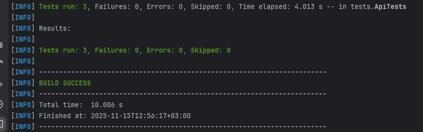
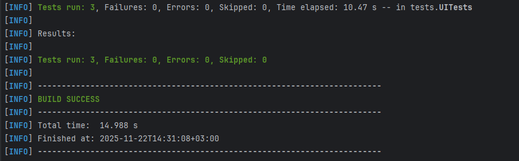
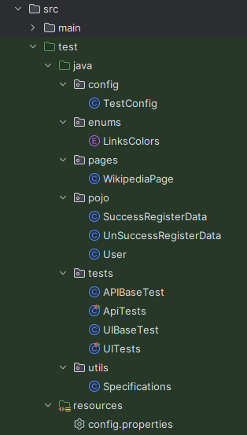

# 🚀 API Testing Automation Project


## 📋 О проекте

Данный проект демонстрирует навыки автоматизации тестирования:

✅ **REST API** - тестирование CRUD операций, валидация JSON схем

✅ **UI тесты** - тестирование веб-интерфейса с Selenide

✅ **Интеграция с CI/CD** - Docker
## 🛠 Технологии
**Java 21** - основной язык программирования

**JUnit 5** - фреймворк для тестирования

**REST Assured** - библиотека для REST API тестирования

**Jackson** - работа с JSON

**Maven** - управление зависимостями

**AssertJ** - fluent assertions

**REST API** - тестирование CRUD операций, валидация JSON схем

**UI тесты** - тестирование веб-интерфейса с Selenide

**Интеграция с CI/CD** - Docker

## 🚀 Быстрый старт
### Предварительные требования
Java 21

Maven 3.6

Git
## 💻 Локальный запуск тестов
### Клонирование репозитория
```bash
   git clone https://github.com/Moriarti85/AQA-Portfolio.git
   cd api-testing-project
```
### Запуск тестов
```bash
   mvn clean test
````
### Запуск с генерацией отчета
```bash
   mvn clean test surefire-report:report
```
## 🐳 Запуск тестов в Docker
### Предварительные требования
- Установленный [Docker](https://docs.docker.com/get-docker/)
- Установленный [Docker Compose](https://docs.docker.com/compose/install/)
- 4+ GB свободной оперативной памяти

### Быстрый запуск
```bash
# Клонировать репозиторий
   git clone https://github.com/Moriarti85/AQA-Portfolio.git
   cd AQA-Portfolio

# Запустить все тесты (API + UI)
   docker-compose up --build
```
Project Link: https://github.com/Moriarti85/AQA-Portfolio
## Скриншоты
### Прогон API тестов

### Прогон UI тестов

### Струкура проекта
